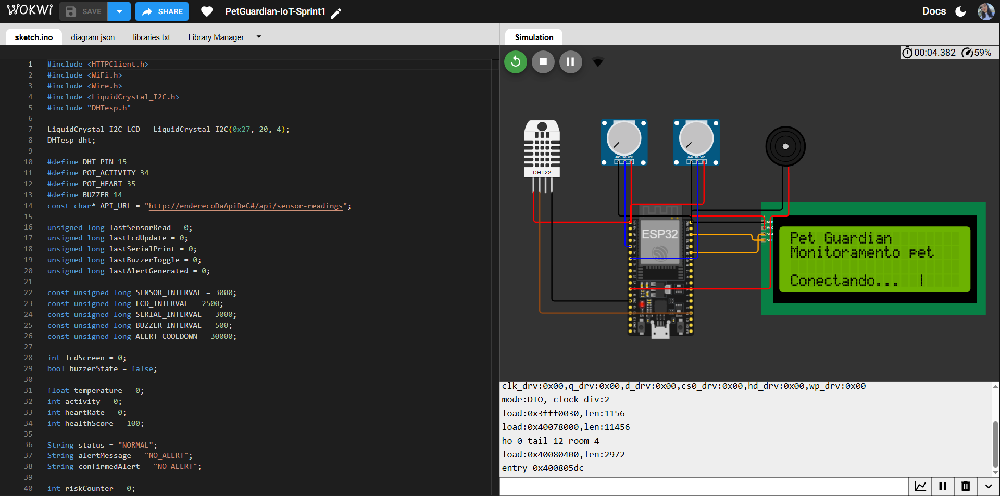
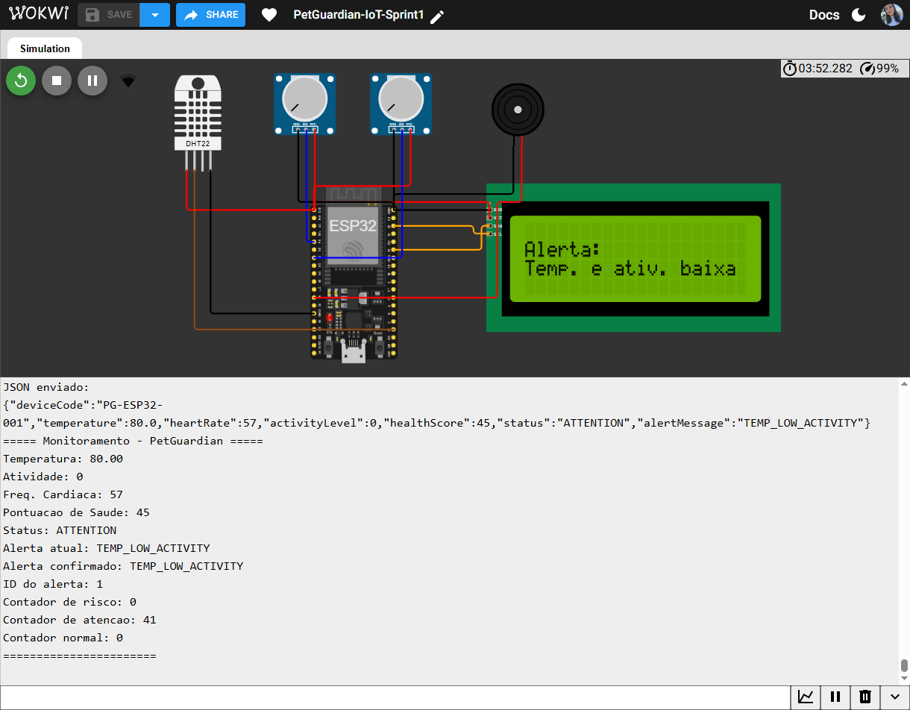
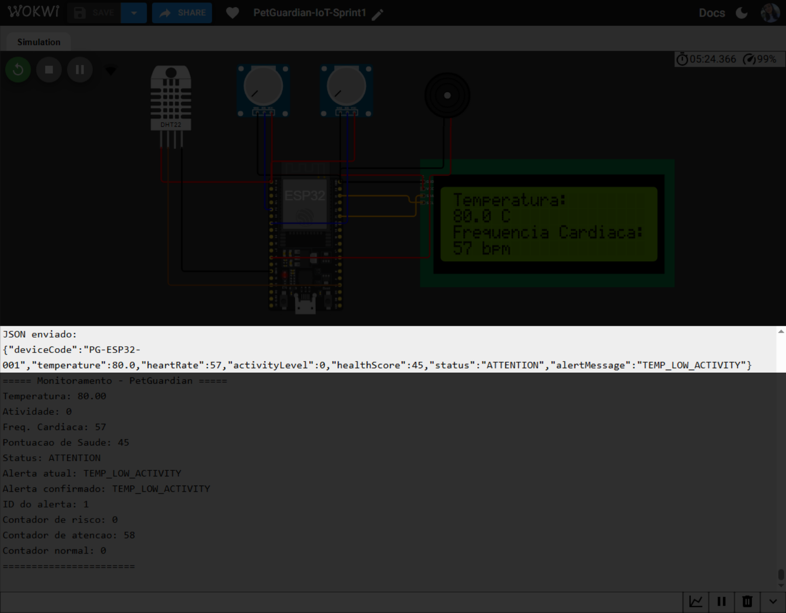
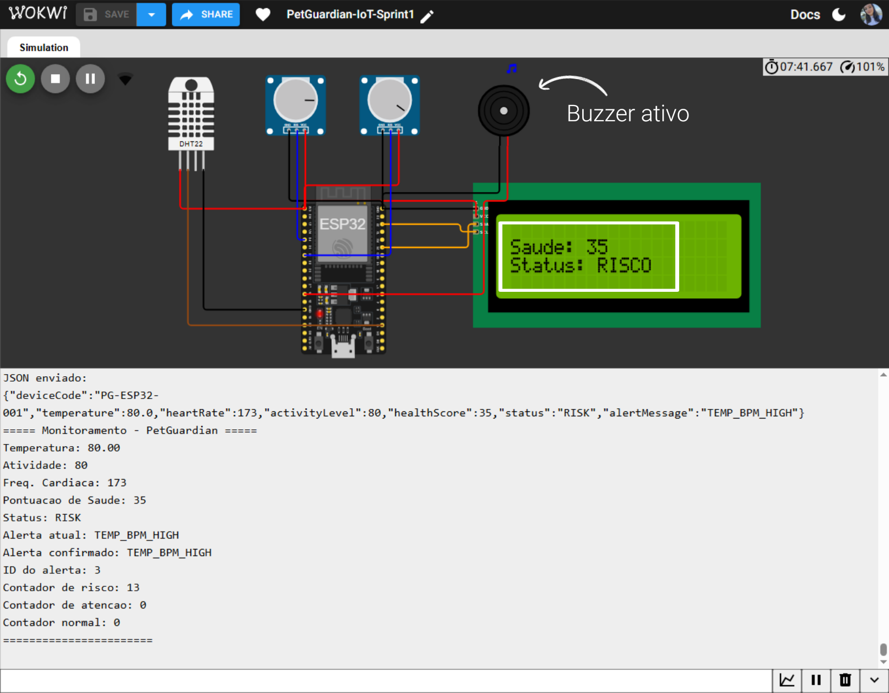

  

  
<h1 align="center">🐾 Pet Guardian - Monitoramento IoT de Pets</h1>

<h3>
  Sistema de monitoramento de saúde em tempo real para pets, desenvolvido com ESP32 e sensores de temperatura e frequência cardíaca. Os dados são exibidos em um display LCD e enviados para uma API REST.
</h3>

---

## 🛠️ Tecnologias Utilizadas

**⚙️ Hardware**
- ESP32
- Sensor de temperatura e umidade DHT22 (simula a temperatura corporal/ambiente do pet)
- Display LCD 20x4
- Buzzer (para alertas sonoros emergenciais, é ativado apenas em situações críticas.)
- 2× Potenciômetros (simulam atividade física e frequência cardíaca)

**📚 Software e bibliotecas**
- `LiquidCrystal_I2C` - controle do display LCD via I2C
- `DHTesp` - leitura do sensor DHT22
- `WiFi.h` - conexão Wi-Fi
- `HTTPClient.h` - envio de dados para a API

**💻 Ambiente de Simulação**
- [Wokwi](https://wokwi.com) - simulador de circuitos para ESP32/Arduino

---

## ▶️ Como Executar o Projeto

Siga os passos abaixo para executar o projeto:

### Simulação no Wokwi:
1. Acesse o projeto no Wokwi: [Clique aqui.](https://wokwi.com/projects/464756501156900865)
 

 

2. Clique em **Play** para iniciar a simulação
3. Ajuste os potenciômetros para simular diferentes níveis de atividade e frequência cardíaca
4. Observe as leituras no display LCD e no Serial Monitor

### Execução em hardware real
1. Monte o circuito conforme o projeto apresentado no Wokwi
2. Instale as dependências no Arduino IDE:
   - `LiquidCrystal_I2C`
   - `DHTesp`
4. Faça o upload do `sketch.ino` para o ESP32

---

## 🧩 Funcionamento

O sistema lê os sensores a cada 3 segundos e calcula um **score de saúde** (0–100) com base em três indicadores:

| Indicador | Condição de alerta |
|---|---|
| Temperatura | Acima de 39,5 °C |
| Frequência cardíaca | Acima de 150 bpm |
| Nível de atividade | Abaixo de 25% |

Com base no score, o sistema classifica o status do pet:

| Score | Status |
|---|---|
| 70–100 | Normal |
| 40–69 | Atenção |
| 0–39 | Risco |

Quando o status **Risco** é confirmado por 3 leituras consecutivas, o buzzer é acionado e um alerta é enviado à API. O display LCD alterna entre 3 telas a cada 2,5 segundos.

---

## ✅ Projeto funcionando

- Display exibindo temperatura, frequência cardíaca, score de saúde e alertas:
  1. Tela Health Score
    

  2. Tela Frequência cardiaca e Temperatura
    
    
  3. Tela Alerta
    

- Envio de dados para API REST em formato JSON:
  

- Buzzer ativado em situações de risco:
  

---

## 🎥 Vídeo de demonstração

---

## 👥 Integrantes do Grupo

<table>
  <tr>
    <td width="130">
      
    </td>
    <td>
      <b>Moisés Barsoti Andrade de Oliveira</b> 
      <b>RM:</b> 565049 &nbsp;&nbsp;|&nbsp;&nbsp;<b>Turma:</b> 2TDSPG - FIAP  
    </td>
  </tr>

  <tr>
    <td width="130">
      
    </td>
    <td>
      <b>Sofia Siqueira Fontes</b> 
      <b>RM:</b> 563829 &nbsp;&nbsp;|&nbsp;&nbsp;<b>Turma:</b> 2TDSPG - FIAP  
    </td>
  </tr>

  <tr>
    <td width="130">
      
    </td>
    <td>
      <b>Luna de Carvalho Guimarães</b> 
      <b>RM:</b> 564887 &nbsp;&nbsp;|&nbsp;&nbsp;<b>Turma:</b> 2TDSPG - FIAP  
    </td>
  </tr>
</table>

---